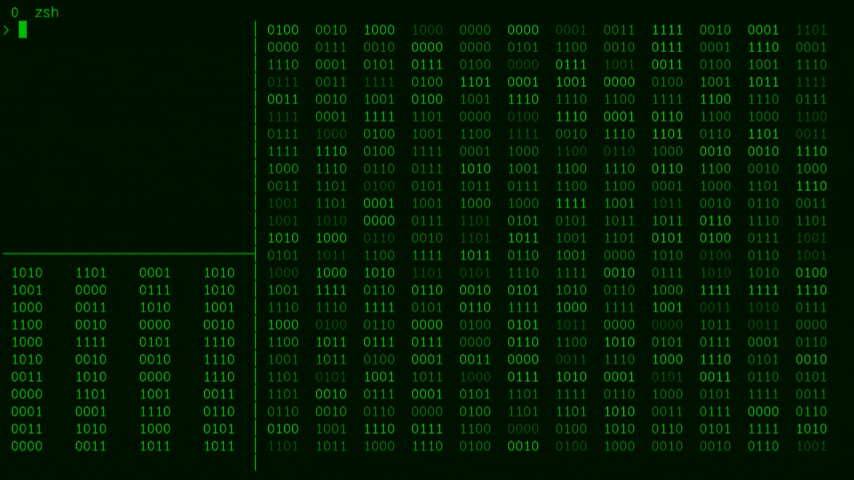

# Binary Rain

This Bash script creates a visually appealing "binary rain" effect in your terminal. It displays streams of random 4-bit binary numbers, with customizable options for colors, spacing, speed, and block display.

## Features

- **Customizable Color:** Choose between foreground (`fg`) or background (`bg`) colored output, or disable colors completely.
- **Adjustable Speed:** Control the update speed of the entire display and the speed at which individual blocks change.
- **Flexible Spacing:**  Add or remove spaces between individual binary numbers.
- **Separator Control:** Use tabs or spaces to separate blocks of binary numbers.
- **Configurable Blocks:** Define the number of blocks of binary numbers to display.
- **Color/No-color modes:** Ability to completely disable the color output.

## Usage
```binary-rain.sh [-b <num_blocks>] [-s <update_speed>] [-d <block_speed>] [-m <display_mode>] [-p <space_mode>] [-t <separator_mode>] [-c <color_mode>]```

### Options

- -b <num_blocks>:  Number of blocks to display (default: 4).
- -s <update_speed>: Update speed of the whole display in seconds (default: 0.1).
- -d <block_speed>: Delay between block changes in seconds (default: 0.02).
- -m <display_mode>: Display mode, either bg (background color) or fg (foreground color) (default: fg).
- -p <space_mode>: Spacing mode, either nospace (no space) or space (space between numbers) (default: space).
- -t <separator_mode>: Separator mode, either tab or space (default: tab).
- -c <color_mode>: Color mode, either color (with color) or nocolor (without color) (default: color).

### Examples

- Run the script with default settings:

```binary-rain.sh```
- Display 4 blocks with a background color and no spaces between numbers:

```binary-rain.sh -b 6 -m bg -p nospace```
- Display 3 blocks, update every 0.5 seconds, with foreground color and space separator:
 
```binary-rain.sh -b 3 -s 0.5 -m fg -t space```

- Display the binary rain without any color output
  
```binary-rain.sh -c nocolor```

▌Prerequisites

- A Unix-like operating system (Linux, macOS, etc.)
- Bash shell

▌How to Install

1. Clone the repository:

```git clone https://github.com/slovjinika/binary-rain.git```

2. Navigate to the directory:
  
```cd binary-rain```

3. Make the script executable:

```chmod +x binary-rain.sh```

4. Run the script:
 
```binary-rain.sh```
